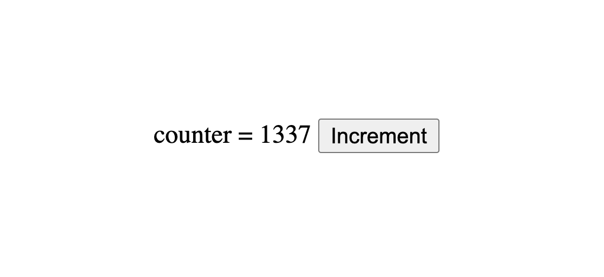

# Deno React Hello World


## Running it
Set up [deno](https://deno.land/#installation) on your machine

Then run 

`./build.sh`

and then open a web browser 

```
xdg-open index.html    # (Linux)

# or...

open index.html    # (Mac)
```


## Credits

Forked from https://github.com/rsmelo92/deno-hello-world
